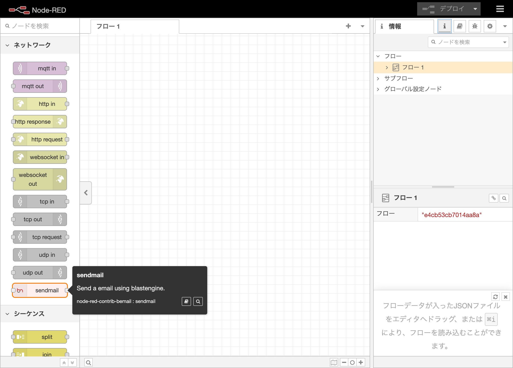
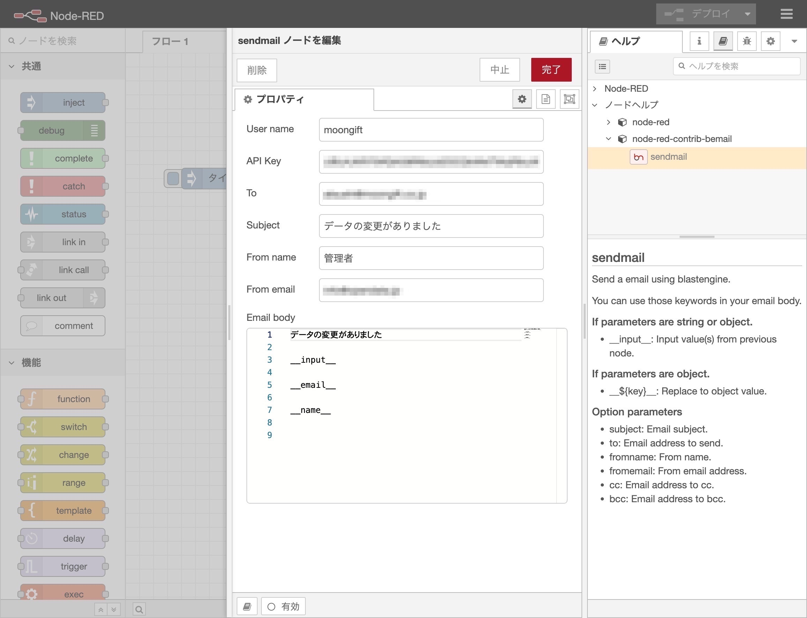

# blastengine node for Node-RED

Send email with blastengine by Node-RED

## Install

```
npm install node-red-contrib-bemail
```

When you install the node, you need to restart Node-RED. After restarting, you can see the node in the `network` palette.



## Usage

Input settings parameters.

- username  
Username of blastengine account.
- apikey  
API key of blastengine account.
- to  
Email address of recipient.
- subject  
Subject of email.
- message  
Mail body of email.
- fromname  
From name of email.
- fromemail  
From email address of email.

Every parameters are default value. You can replace parameters by payload.



## Message body

You can use keywords in message body.

- __input__  
Input values from previous node. You can use it if previous node return single value.
- __{key}__
Value of key in payload.

### Example

If your previous node send those json.

```json
{
	"value": "new value"
}
```

You can use `input` and `value` in message body.

```
We got new values.

__input__

__value__
```

`__input__` will be replaced to `{ "value": "new value" }` and `__value__` will be replaced to `new value`.

## Response

You can get response from blastengine.

```json
{
	"deliveryId": 99999
}
```

Or error messages from blastengine.

```json
{
	"error_messages": {
		"to": [
			"user@example.com: data is invalid email address."
		]
	}
}
```

## License

MIT
